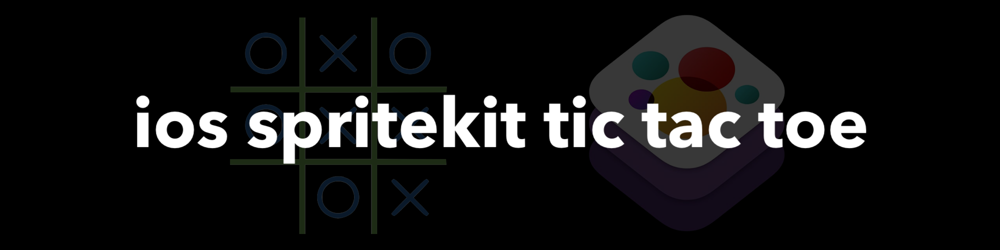

# ios-tic-tac-toe 

**Last Update: 20/February/2018.**

### If you like the project, please give it a star ⭐ It will show the creator your appreciation and help others to discover the repo.

# ✍️ About 
Class `Tic Tac Toe` reincarnation with AI and state machines. The app is ready-made, using `SpriteKit` and `GameplayKit` frameworks. The app supports `Swift 4.2` with minimum deployment target for `iOS 10.0`.

# 📺 Demo
iPhone             |  iPad
:-------------------------:|:-------------------------:
  |  

# 👨‍💻 Author
[Astemir Eleev](https://github.com/jVirus)

# 🔖 Licence 
The project is available under [MIT Licence](https://github.com/jVirus/crosses-and-zeros-ios-game/blob/master/LICENSE).

The project uses assets from [kenney.nl](https://kenney.nl) under [CC0 1.0 Universal (CC0 1.0)
Public Domain Dedication licence](https://creativecommons.org/publicdomain/zero/1.0/)
